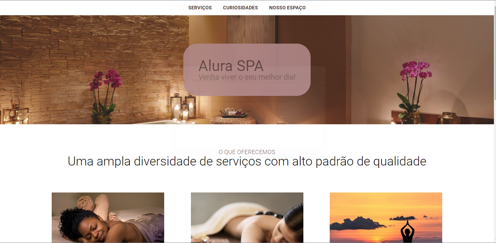

# Alura Spa 

Esta é uma página web desenvolvida de acordo com o curso de sass da Alura.

## Table of contents

- [Telas](#Telas)
- [Links](#Links)
- [Ferramentas](#Ferramentas)
- [Aprendizado](#Aprendizado)
- [Contato](#Contato)

### Telas

### Links

[Solution URL](https://kaiojesus.github.io/alura-spa-projeto_inicial/index.html)

### Ferramentas

- HTML 5
- CSS
- Sass
- Git e GitHub

### 📝 Aprendizado

Neste [curso da alura de sass](https://cursos.alura.com.br/course/sass-css-sintaticamente-espetacular), aprendi como a mexer com esse framework, criar variáveis, funções, aninhamentos e outras propriedades do css que estão explicadas como comentário do código.

### ✉ Contato 

- [LinkedIn](https://www.linkedin.com/in/kaio-jesus/) 
- [kaiojesus41@gmail.com](kaiojesus41@gmail.com)